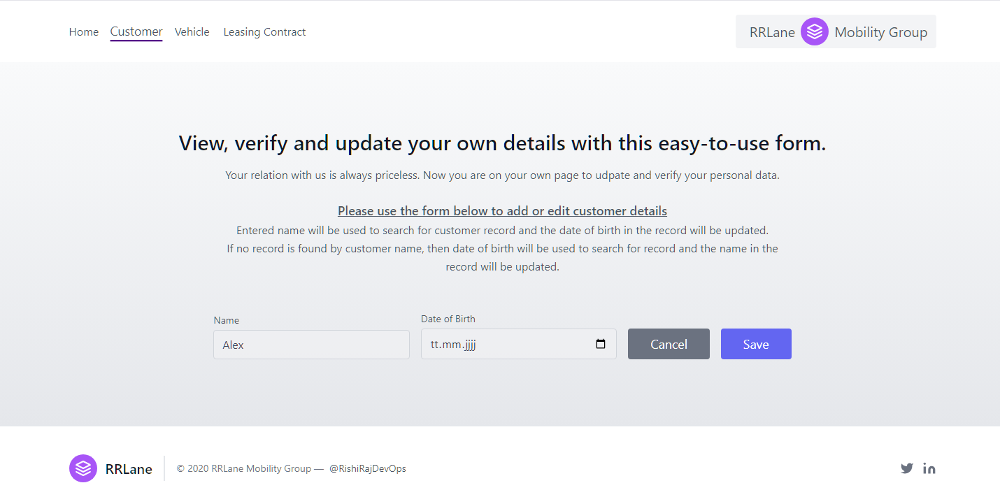
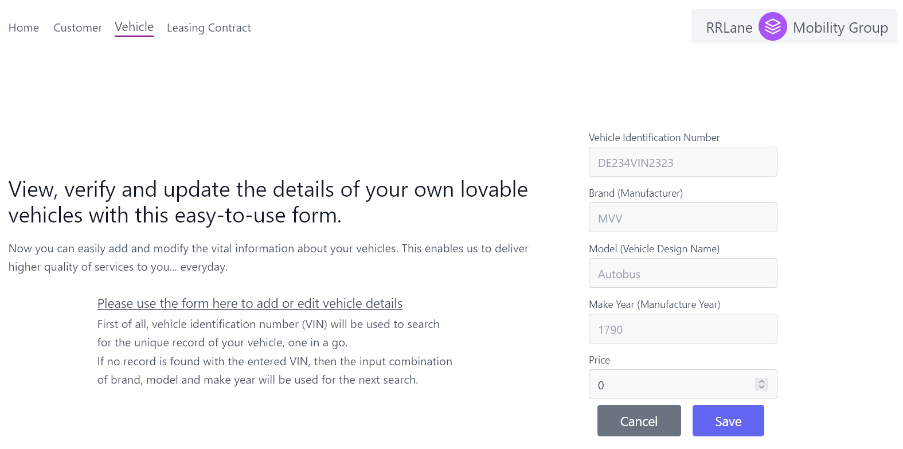

# Online Vehicle Leasing [B2C, B2B]
## Note: The code here is available in repos for quick review and feedback. Continuous development is going on.

This project is a commerce-targetting app for the following classes of end-users:
- lessee, referred to as `customer` in the project, and
- lessor, referred to as `provider`.

The app is designed with two modules contained in it:
- backend, in the directory `contractapi`, and
- frontend, in the directory `clientng`. (under active development)

One more implementation (ReactJS-NextJS) of frontend is also to be presented in future.

Using this app, Lessees can perform these actions in the context of vehicles and leasing contracts:
- take vehicles on lease,
- abide by and fulfill such leasing contracts, and
- return the leased vehicles to respective providers.

_User Self-Help Portal:_ The usage scenarios for lessors are not ready in the current version of the app as the app is more focused towards customer usage. 
However, the app may be easily extended to add lessor use cases and administrator scenarios.

## Technologies Used to Build the versatile Utility
- Angular 18 (Frontend Web UI with Angular 18)
- Kotlin 1.9 (Java 21 API level)
- Spring Boot 3
- MySQL (containerized)
- JPA (Jakarta Persistence API)
- Hibernate for JPA/ORM
- Docker with multi-stage docker-compose and Dockerfile
- Gradle (Kotlin DSL)
- Flyway for database migration
- SLF4J for logging
- ELK stack (ELK: Elasticsearch, Kibana, Logstash) for log monitoring and analysis (to be added soon)
- React 18 (Frontend app with React 18, TypeScript and Vite/Bun planned for future)

## This Spring brings good luck with these developments
- the stable and charming frontend app with Angular
- to use parameters for secrets with Docker Compose and enhance the platform security
- to orchestrate the containers in Kubernetes clusters (next up!)

## Screenshots
### Developer Experience (Containers running smooth and stable)

The following screenshots depict the capabilities of this versatile application:
### Contract Manager

### Customer Manager

### Vehicle Manager

### Home View
- 

- 

## Business Scenario and Use Cases

### Main Actors
- Customer, with properties: name, birthdate
- Vehicle, with properties: brand, model, year of manufacture, VIN, price
- Lease Contract, with essential properties: lease contract number, monthly rate (for billing)

#### Viewing Contract Summary [under development]
The following details are shown at summary level:
- lease contract number
- customer name
- vehicle details (branc, model, year)
- VIN separately ("--" shown if VIN is not available)
- contract rate
- vehicle price
- anchor link to view more details

Indicative illustration is below:  
|----------Contract Overview---------------------------------------------------------------------------------------------|  
|Contract Nr.   |Customer Name   |Vehicle            |VIN       |Contract Rate (Monthly)    |Vehicle Price More Details  |  
|134856         |Maximill Muster |Audi A20 (2023)    |A65413    |654,20                     |33465,80                    |  
|146349         |Angel Angle     |Neo X4 (2024)      |--        |453,00                     |40321,00                    |  
|------------------------------------------------------------------------------------------------------------------------|  

#### Customer Entry Form [under development]
It is a form with fields to enter customer name and birthdate, along with "Update" and "Cancel" buttons.

#### Vehicle Entry Form [under development]
It is a form with fields to enter all five properties (detail points) of vehicle to add or update, with "Update" and "Cancel" buttons.

#### Lease Contract Entry Form [under development]
A form to enter contract number, monthly rate of contract, related customer name and related vehicle details. Customer name and vehicle details may be picked out of database in order to select existing data about customer and vehicle, respectively.

## Preconditions to Run the Application

This application requires the following software packages to run properly:
- a command line interpreter. Bash is preferred. CMD for Windows also works. The command in this readme run very well with [Bash](https://www.gnu.org/software/bash/). For having Bash on a Windows box, you may install [Git Bash](https://git-scm.com/download/win).
- [Docker](https://www.docker.com/)
- a web browser. [Chrome](https://google.com/chrome/) is preferred. Other web browsers may work for most functionalities.

## Installation
The application can be set up and started in two distinct methods.

### 1. Local build and execution
- Using your favorite Terminal app for shell, clone the files (source code and configuration) from GitHub repository:
<pre>git clone https://github.com/rishiraj88/leasing.git</pre>

- In your file explorer, go to `leasing/contract` directory:
<pre>cd leasing/contract</pre>

- Build the project locally with  gradle wrapper:
<pre>./gradlew build</pre>

### 2. Pulling the pre-built Docker image
- Run this command in Terminal app to pull and start the latest contract image published on Docker Hub for project backend:
<pre>docker run i50729/contract</pre>

In its current stage of development, the backend app runs well with locally available mysql container and the accompanying frontent `leasingclient`.

One important point to note here: All three (mysql, backend and frontend) must be in a common(=single,shared) network in order to work together. For non-tech-savvy users, it is not an easy feat. Currently work on this is going on.

## How to Start the Application

- Now you may use the application by visiting this URL:
<pre>http://localhost:4200/home</pre>

- Freely navigate to and use the sections `Customers`, `Vehicles` and `Leasing Contracts` under `Manage` menu.

## Reason of Chosen Solution
The chosen solution corresponds to the use the modern technologies available so as to model complex dynamic systems easily. Hence it enables the businesses to work on heavy-cash businesses more conveniently.

## General Notes
Due to some constraints, I have built the MVP. For enhancing and fostering the solution, tech discussions on relevant parameters and methods are always cited and welcome.

## Notes for Developers

### The backend of the app has been packaged and published with the following commands:

- In your file explorer, go to `leasing/contract` directory:
<pre>cd leasing/contract</pre>

- Build the project locally with  gradle wrapper:
<pre>./gradlew build</pre>

- Build Docker image with:
<pre>docker build -t i50729/contract:latest .</pre>

- Push the Docker image for publishing with:
<pre>docker push i50729/contract:latest</pre>

### The Frontend of the app can be started as follows:

- Build the Docker container network by running:
<pre>`docker-compose build</pre>
<pre>docker-compose up -d</pre>

- Go to `leasingclient` directory under `leasing`.
<pre>cd leasingclient</pre>

- Build and run the Angular-based frontend with these commands:
<pre>npm install</pre>
<pre>ng serve</pre>

## Current Status of Functionalities
1. Only creating and updating customer data is possible. Listing or deleting customer data is not provided for security purpose as the app is to be used by customers.
2. Only creating and updateing vehicle data is possible for secure use by customers.
3. Policy contracts can be listed and viewed by respective customers for the vehicles leased to them.

## For Feedback, Queries, Collaboration
- LinkedIn Profile: https://www.linkedin.com/in/rishirajopenminds
- Contact Card: https://bio.link/rishiraj49de
- X: https://twitter.com/RishiRajDevOps
- Other Repositories: https://github.com/rishiraj88?tab=repositories
